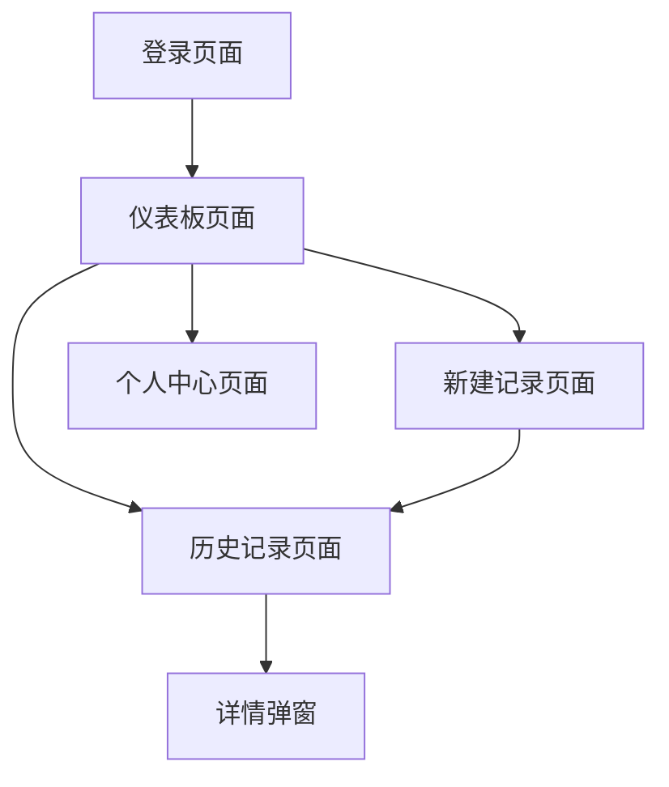

## 1. 产品概述
情侣吵架管理平台UI重构项目，旨在通过Ant Design组件库优化现有界面，提升视觉美观度和用户体验。通过统一的调色方案、排版优化和组件标准化，打造更加现代化和用户友好的界面。

## 2. 核心功能

### 2.1 用户角色
| 角色 | 注册方式 | 核心权限 |
|------|----------|----------|
| 普通用户 | 邮箱注册 | 创建吵架记录、查看历史、编辑个人信息 |
| 高级用户 | 邀请码升级 | 数据分析报告、高级统计功能、导出数据 |

### 2.2 功能模块
重构范围包含以下主要页面：
1. **仪表板页面**：数据概览、统计图表、快速操作入口
2. **新建记录页面**：吵架事件录入、原因选择、严重程度评分
3. **历史记录页面**：事件列表、筛选功能、详情查看
4. **个人中心页面**：用户信息、设置选项、数据导出

### 2.3 页面详情
| 页面名称 | 模块名称 | 功能描述 |
|----------|----------|----------|
| 仪表板页面 | 数据概览卡片 | 显示本月吵架次数、和解率、平均持续时间等关键指标 |
| 仪表板页面 | 统计图表 | 使用Ant Design Charts展示趋势图、饼图等可视化数据 |
| 仪表板页面 | 快速操作 | 提供新建记录、查看历史等快捷入口按钮 |
| 新建记录页面 | 事件录入表单 | 使用Ant Design Form组件收集吵架事件信息 |
| 新建记录页面 | 原因选择器 | 使用Select组件提供预设吵架原因选项 |
| 新建记录页面 | 严重程度评分 | 使用Rate组件让用户评分事件严重程度 |
| 历史记录页面 | 事件列表 | 使用Table组件展示历史吵架记录 |
| 历史记录页面 | 筛选器 | 使用DatePicker、Select等组件提供时间、原因筛选 |
| 历史记录页面 | 详情弹窗 | 使用Modal组件展示事件详细信息 |
| 个人中心页面 | 用户信息卡片 | 使用Card组件展示用户基本信息 |
| 个人中心页面 | 设置面板 | 使用Tabs组件组织不同设置选项 |
| 个人中心页面 | 数据导出 | 使用Button和Progress组件提供导出功能 |

## 3. 核心流程
用户操作流程：
1. 用户登录后进入仪表板，查看数据概览和统计图表
2. 点击"新建记录"进入录入页面，填写吵架事件信息
3. 在历史记录页面查看、筛选过往事件
4. 在个人中心管理账户设置和导出数据

## 4. 用户界面设计

### 4.1 设计风格
- **主色调**：采用Ant Design默认的蓝色系 (#1890ff) 作为主色
- **辅助色**：使用温暖的粉色系 (#ff6b6b) 体现情侣主题
- **按钮样式**：使用Ant Design的圆角按钮，主要操作为实心按钮，次要操作为幽灵按钮
- **字体选择**：优先使用系统默认字体，标题使用16-20px，正文使用14px
- **布局风格**：采用卡片式布局，使用Ant Design的Grid系统进行响应式布局
- **图标风格**：使用Ant Design官方图标库，保持风格一致性

### 4.2 页面设计概览
| 页面名称 | 模块名称 | UI元素 |
|----------|----------|--------|
| 仪表板页面 | 数据概览卡片 | 使用Ant Design的Statistic组件展示关键数据，配以温暖的渐变背景 |
| 仪表板页面 | 统计图表 | 使用Ant Design Charts的LineChart和PieChart，配色与主题协调 |
| 仪表板页面 | 快速操作 | 使用Ant Design的Button.Group，按钮采用渐变色背景 |
| 新建记录页面 | 事件录入表单 | 使用Form组件的垂直布局，标签左对齐，输入框圆角边框 |
| 新建记录页面 | 原因选择器 | 使用带图标的Select组件，下拉菜单使用温暖的配色 |
| 新建记录页面 | 严重程度评分 | 使用自定义颜色的Rate组件， hearts图标替代默认星星 |
| 历史记录页面 | 事件列表 | 使用Table组件，行悬停效果使用温暖的背景色 |
| 历史记录页面 | 筛选器 | 使用紧凑的Input.Group组合多个筛选控件 |
| 历史记录页面 | 详情弹窗 | 使用Modal组件，内容区域使用Card组件嵌套 |
| 个人中心页面 | 用户信息卡片 | 使用Avatar和Descriptions组件组合展示 |
| 个人中心页面 | 设置面板 | 使用Tabs组件，标签页使用温暖的下划线样式 |
| 个人中心页面 | 数据导出 | 使用Progress组件显示导出进度，按钮使用loading状态 |

### 4.3 响应式设计
采用桌面端优先的设计方案，确保在1440px以上宽度的屏幕上有最佳显示效果。通过Ant Design的Grid系统实现响应式布局：
- 桌面端：使用24栅格系统，充分利用横向空间
- 平板端：调整栅格比例，保持内容可读性
- 移动端：采用垂直堆叠布局，确保触控操作友好

### 4.4 交互优化
- 所有按钮添加hover和active状态的视觉反馈
- 表单验证使用Ant Design的实时验证机制
- 加载状态使用Skeleton组件提升用户体验
- 空状态使用Ant Design的Empty组件，配以温馨的插画