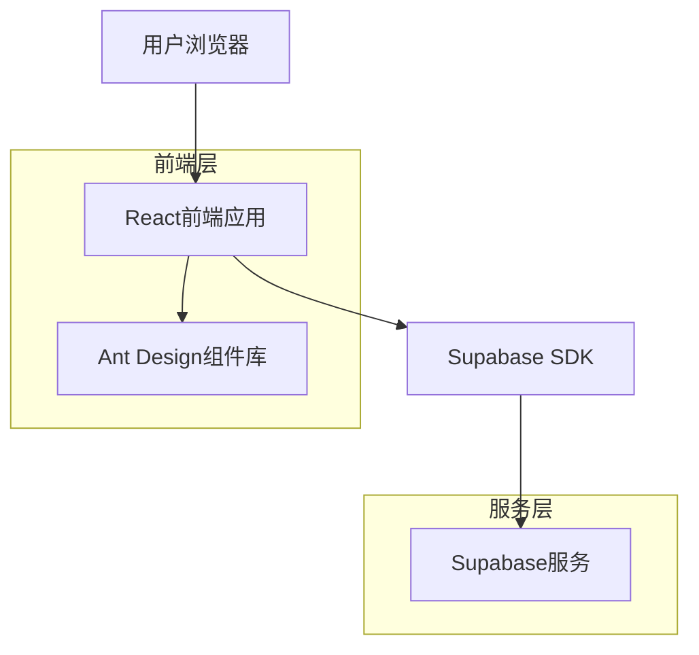
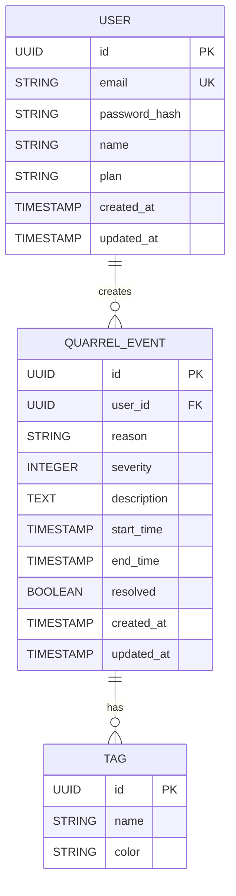

## 1. 架构设计



## 2. 技术描述
- 前端：React@18 + Ant Design@5 + Vite
- 初始化工具：vite-init
- 状态管理：React Context + useReducer
- 后端：Supabase (BaaS)
- 图表库：Ant Design Charts
- 样式方案：Ant Design Token + CSS-in-JS

## 3. 路由定义
| 路由 | 用途 |
|-------|---------|
| / | 登录页面，用户身份验证 |
| /dashboard | 仪表板页面，显示数据概览和统计图表 |
| /new | 新建记录页面，录入吵架事件 |
| /history | 历史记录页面，查看和管理历史事件 |
| /profile | 个人中心页面，用户设置和数据导出 |

## 4. 数据模型

### 4.1 数据模型定义


### 4.2 数据定义语言
用户表 (users)
```sql
-- 创建表
CREATE TABLE users (
    id UUID PRIMARY KEY DEFAULT gen_random_uuid(),
    email VARCHAR(255) UNIQUE NOT NULL,
    password_hash VARCHAR(255) NOT NULL,
    name VARCHAR(100) NOT NULL,
    plan VARCHAR(20) DEFAULT 'free' CHECK (plan IN ('free', 'premium')),
    created_at TIMESTAMP WITH TIME ZONE DEFAULT NOW(),
    updated_at TIMESTAMP WITH TIME ZONE DEFAULT NOW()
);

-- 创建索引
CREATE INDEX idx_users_email ON users(email);
CREATE INDEX idx_users_plan ON users(plan);
```

吵架事件表 (quarrel_events)
```sql
-- 创建表
CREATE TABLE quarrel_events (
    id UUID PRIMARY KEY DEFAULT gen_random_uuid(),
    user_id UUID NOT NULL REFERENCES users(id) ON DELETE CASCADE,
    reason VARCHAR(100) NOT NULL,
    severity INTEGER CHECK (severity >= 1 AND severity <= 5),
    description TEXT,
    start_time TIMESTAMP WITH TIME ZONE NOT NULL,
    end_time TIMESTAMP WITH TIME ZONE,
    resolved BOOLEAN DEFAULT FALSE,
    created_at TIMESTAMP WITH TIME ZONE DEFAULT NOW(),
    updated_at TIMESTAMP WITH TIME ZONE DEFAULT NOW()
);

-- 创建索引
CREATE INDEX idx_quarrel_events_user_id ON quarrel_events(user_id);
CREATE INDEX idx_quarrel_events_start_time ON quarrel_events(start_time DESC);
CREATE INDEX idx_quarrel_events_resolved ON quarrel_events(resolved);

-- 权限设置
GRANT SELECT ON quarrel_events TO anon;
GRANT ALL PRIVILEGES ON quarrel_events TO authenticated;
```

### 4.3 Ant Design组件使用规范
```typescript
// 主题配置示例
import { ConfigProvider, theme } from 'antd';

const customTheme = {
  token: {
    colorPrimary: '#1890ff',
    colorInfo: '#1890ff',
    colorSuccess: '#52c41a',
    colorWarning: '#faad14',
    colorError: '#ff4d4f',
    borderRadius: 8,
    wireframe: false,
  },
  components: {
    Button: {
      borderRadius: 8,
      colorPrimary: 'linear-gradient(135deg, #667eea 0%, #764ba2 100%)',
    },
    Card: {
      borderRadius: 12,
      boxShadow: '0 4px 12px rgba(0, 0, 0, 0.1)',
    },
    Rate: {
      colorFillContent: '#ff6b6b',
    },
  },
};

// 组件使用示例
import { Card, Statistic, Table, Form, Select, Rate, Button } from 'antd';
import { HeartOutlined, HeartFilled } from '@ant-design/icons';

// 数据展示卡片
<Card hoverable>
  <Statistic
    title="本月吵架次数"
    value={12}
    prefix={<HeartOutlined />}
    valueStyle={{ color: '#ff6b6b' }}
  />
</Card>

// 严重程度评分
<Rate
  character={<HeartFilled />}
  style={{ color: '#ff6b6b' }}
  count={5}
/>

// 原因选择器
<Select
  placeholder="选择吵架原因"
  options={[
    { label: '生活习惯', value: 'habit' },
    { label: '金钱问题', value: 'money' },
    { label: '家庭关系', value: 'family' },
    { label: '工作压力', value: 'work' },
  ]}
/>
```

## 5. 性能优化策略
- 使用React.memo和useMemo优化组件重渲染
- 实现虚拟滚动处理大量历史数据
- 使用Ant Design的Skeleton组件优化加载体验
- 通过Supabase的实时订阅功能实现数据同步
- 使用Service Worker实现离线缓存

## 6. 部署配置
```bash
# 依赖安装
npm install antd @ant-design/icons @ant-design/charts @supabase/supabase-js

# 环境变量配置
VITE_SUPABASE_URL=your_supabase_url
VITE_SUPABASE_ANON_KEY=your_supabase_anon_key
VITE_APP_NAME=CoupleQuarrelPlatform

# 构建优化
# vite.config.ts
export default defineConfig({
  build: {
    rollupOptions: {
      external: ['@ant-design/icons'],
    },
  },
});
```